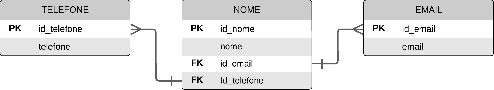

Este é um projeto simples de gerenciamento de contatos desenvolvido em Python, utilizando SQLite como banco de dados.
O objetivo é fornecer funcionalidades básicas para criar, visualizar, inserir e excluir contatos de uma agenda.

## Funcionalidades

- **Criar Tabela:** Cria uma tabela no banco de dados para armazenar informações de contatos.
- **Inserir Dados:** Adiciona novos contatos à tabela, fornecendo nome, telefone e email.
- **Deletar Dados:** Remove contatos com base em seu id.
- **JOIN entre Tabelas:** Realiza operações JOIN entre diferentes tabelas para combinar informações.

## Dicionário de dados

## Diagrama de Relacionamento

